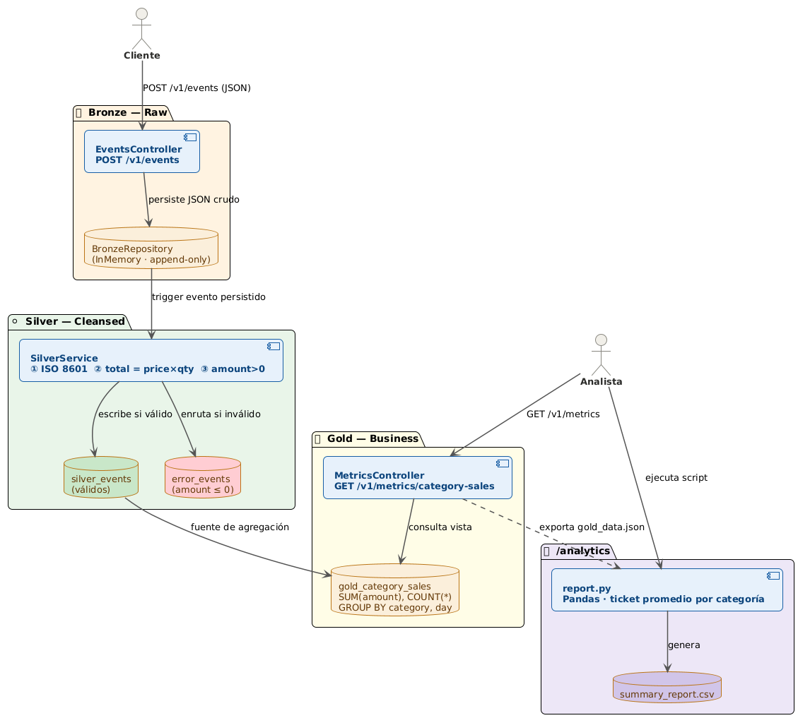
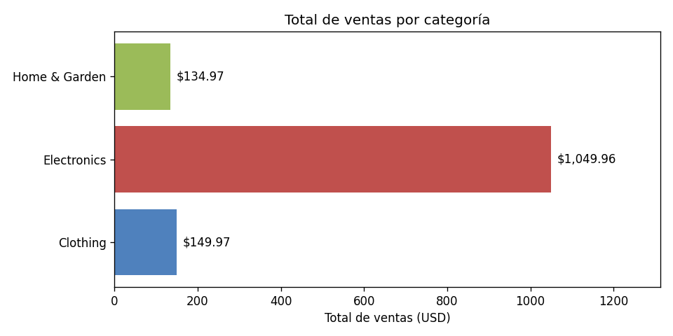
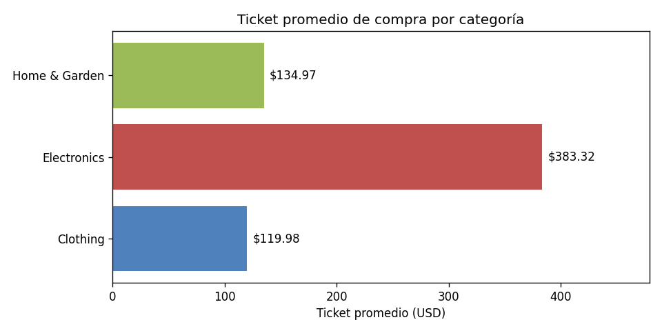
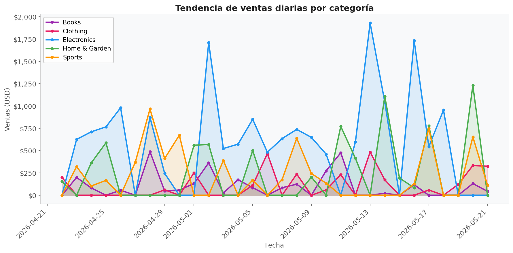
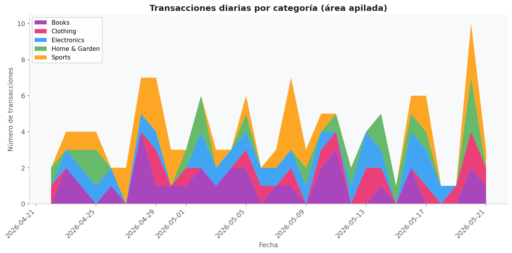
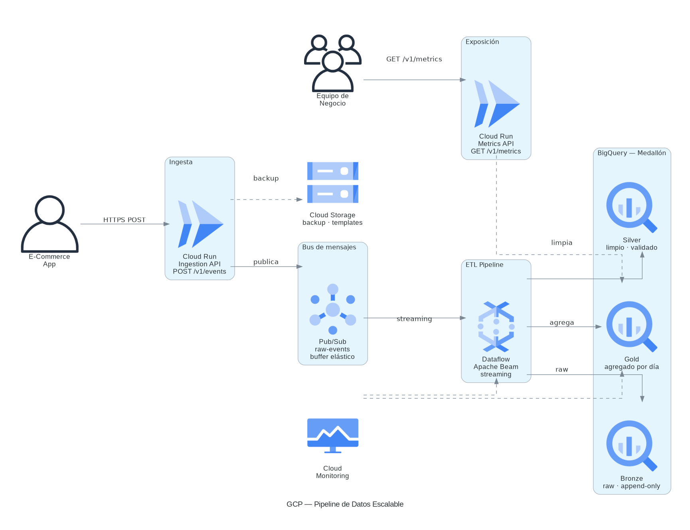
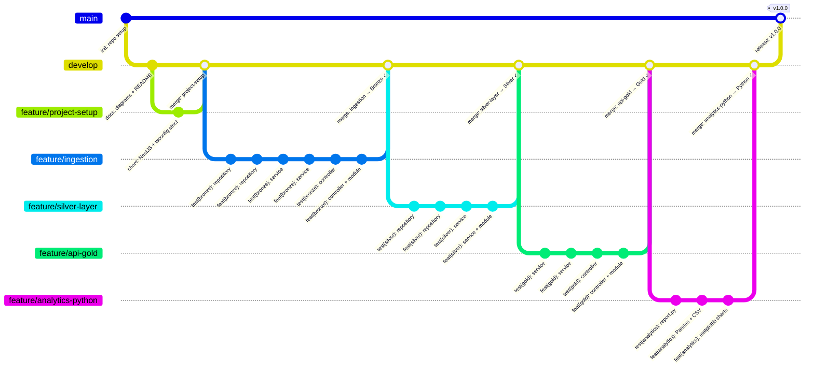

# ecommerce-pipeline

Pipeline de datos para una plataforma de E-Commerce.
Recibe eventos de ventas via API REST y los procesa en tres capas (Bronze → Silver → Gold) siguiendo la Arquitectura Medallón. Expone métricas de negocio via GET endpoint y genera reportes analíticos con Python/Pandas.

---

## Tecnologías

- **NestJS + TypeScript** — API REST con tipado estricto
- **Jest** — testing con TDD (43 tests)
- **BigQuery** — simulado localmente con Repository Pattern
- **Python 3 + Pandas + Matplotlib** — análisis y visualización de datos
- **GCP** — arquitectura de producción escalable

---

## Cómo ejecutar localmente

### Requisitos previos

- Node.js >= 18
- Python >= 3.10
- Git

### Paso 1 — Clonar e instalar dependencias

```bash
git clone https://github.com/danielyatacoblas/data-e_commerce-medallion.git
cd data-e_commerce-medallion
npm install
```

### Paso 2 — Configurar variables de entorno

```bash
cp .env.example .env
```

> Para correr localmente solo necesitas `PORT=3000`. Las variables de GCP son para cuando se conecte a la infraestructura real.

### Paso 3 — Levantar el servidor (Terminal 1)

Abre una terminal y déjala corriendo:

```bash
npm run start:dev
```

Verás este output cuando el servidor esté listo:

```
[Nest] LOG [NestFactory] Starting Nest application...
[Nest] LOG [InstanceLoader] BronzeModule dependencies initialized
[Nest] LOG [InstanceLoader] SilverModule dependencies initialized
[Nest] LOG [InstanceLoader] GoldModule dependencies initialized
[Nest] LOG [RouterExplorer] Mapped {/v1/events, POST} route
[Nest] LOG [RouterExplorer] Mapped {/v1/metrics/category-sales, GET} route
[Nest] LOG [NestApplication] Nest application successfully started
```

El servidor corre en `http://localhost:3000`. **Deja esta terminal abierta.**

### Paso 4 — Ingresar eventos al pipeline (Terminal 2)

Abre una segunda terminal. Envía eventos con `POST /v1/events` — cada llamada persiste el evento en la capa **Bronze**:

```bash
curl -X POST http://localhost:3000/v1/events \
  -H "Content-Type: application/json" \
  -d '{
    "transaction_id": "tx_001",
    "customer_id": "usr_abc123",
    "timestamp": "2026-05-21 15:30:00 UTC",
    "product": {
      "id": "prod_55",
      "category": "Electronics",
      "price": 299.99
    },
    "quantity": 2
  }'
```

Respuesta `201` por cada evento enviado:

```json
{ "status": "received", "transaction_id": "tx_001", "layer": "bronze" }
```

Puedes enviar varios eventos con distintas categorías y fechas para ver el pipeline completo.

### Paso 5 — Consultar métricas Gold (Terminal 2)

Una sola llamada GET dispara todo el pipeline: Bronze → Silver (limpieza) → Gold (agregación):

```bash
curl http://localhost:3000/v1/metrics/category-sales
```

Respuesta `200` con ventas agrupadas por categoría y día:

```json
[
  {
    "category": "Electronics",
    "sale_date": "2026-05-21",
    "total_sales": 599.98,
    "transaction_count": 2
  },
  {
    "category": "Clothing",
    "sale_date": "2026-05-21",
    "total_sales": 149.97,
    "transaction_count": 3
  }
]
```

### Paso 6 — Generar reporte analítico Python (Terminal 2)

Con el servidor aún corriendo, en la misma segunda terminal instala las dependencias Python y ejecuta el script analítico:

```bash
cd analytics/
pip install -r requirements.txt
python report.py
```

Output esperado:

```
Archivos generados:
  CSV : .../analytics/summary_report.csv
  PNG : .../analytics/charts/sales_by_category.png
  PNG : .../analytics/charts/ticket_promedio_by_category.png

     category  total_sales  transaction_count  ticket_promedio
     Clothing       239.96                  2           119.98
  Electronics      1149.96                  3           383.32
Home & Garden       134.97                  1           134.97
```

Esto genera en `analytics/`:
- `summary_report.csv` — tabla de métricas por categoría
- `charts/sales_by_category.png` — donut de distribución de ventas
- `charts/ticket_promedio_by_category.png` — lollipop de ticket promedio
- `charts/sales_trend.png` — tendencia diaria de ventas (línea + área)
- `charts/daily_transactions.png` — transacciones diarias (área apilada)

### Paso 7 — Correr los tests

```bash
# Desde la raíz del proyecto
npm run test
```

---

## Flujo del Pipeline

```
POST /v1/events
      |
      v
 [Bronze Layer]
 Guarda evento raw + agrega ingested_at
      |
      v
 [Silver Layer]  <-- se activa al llamar GET /v1/metrics
 - Convierte timestamp a ISO 8601
 - Calcula total_amount = price x quantity
 - Rechaza registros con total_amount <= 0 (error_events)
      |
      v
 [Gold Layer]
 Agrega SUM(total_sales) y COUNT(*) GROUP BY category, DATE
      |
      v
 GET /v1/metrics/category-sales
```

---

## Arquitectura Medallón (local)



| Capa | Qué hace |
|------|----------|
| **Bronze** | Guarda el evento JSON exactamente como llega, sin tocar nada |
| **Silver** | Limpia la fecha, calcula `total_amount = price × quantity`, rechaza montos ≤ 0 |
| **Gold** | Agrupa ventas por categoría y día (`SUM`, `COUNT`) para el negocio |

---

## Analytics Python

### Instalación

```bash
cd analytics/
pip install -r requirements.txt
```

### Generar datos masivos (opcional)

Si quieres alimentar el pipeline con 120 eventos reales antes de correr el reporte:

```bash
# Con el servidor corriendo en Terminal 1:
python generate_events.py
```

Output esperado:

```
Enviando 120 eventos al pipeline...
  20/120 — ultimo: tx_0020 -> received
  ...
  120/120 — ultimo: tx_0120 -> received

Obteniendo metricas Gold (Bronze -> Silver -> Gold)...
  Registros agregados: 85

Guardado: gold_data.json
```

### Ejecución del reporte

```bash
python report.py
```

El script:
1. Lee `gold_data.json` (datos exportados del endpoint Gold)
2. Calcula `ticket_promedio = total_sales / transaction_count` por categoría con Pandas
3. Guarda `summary_report.csv`
4. Genera 4 gráficas KPI en `charts/`

### Resultado CSV

Basado en 120 eventos procesados a través del pipeline completo:

| category | total_sales | transaction_count | ticket_promedio |
|----------|------------|-------------------|-----------------|
| Books | 2,979.58 | 31 | 96.12 |
| Clothing | 3,108.59 | 17 | 182.86 |
| Electronics | 17,624.99 | 25 | 705.00 |
| Home & Garden | 7,516.00 | 19 | 395.58 |
| Sports | 6,401.73 | 28 | 228.63 |

### Dashboard KPI

**Distribución de ventas por categoría (Donut)**



**Ticket promedio por categoría (Lollipop)**



**Tendencia de ventas diarias (Línea + área)**



**Transacciones diarias por categoría (Área apilada)**



---

## Escalabilidad en GCP



> Ver versión detallada: [`diagrams/diagram_gcp_Detailed.png`](diagrams/diagram_gcp_Detailed.png)

### Estrategia de escalabilidad

El problema central con millones de eventos por segundo es que **la ingesta y el procesamiento no pueden correr al mismo ritmo en el mismo proceso**. Si el API recibe picos de tráfico y el procesamiento Silver tarda, se pierden eventos o el sistema colapsa.

La solución es **desacoplar las tres capas con servicios gestionados**, cada uno escalando de forma independiente:

**1. Cloud Run — ingesta elástica**
El `EventsController` se containeriza y despliega en Cloud Run. Escala automáticamente de 0 a miles de instancias según el volumen de requests, sin configurar servidores. Cada instancia solo hace una cosa: validar el JSON y publicar en Pub/Sub. Responde en milisegundos.

**2. Pub/Sub — buffer indestructible entre capas**
Es el punto de desacoplamiento clave. Cloud Run publica el evento raw en un topic de Pub/Sub y responde `201` inmediatamente — sin esperar a que Bronze ni Silver procesen nada. Pub/Sub garantiza entrega al menos una vez, soporta millones de mensajes por segundo y permite replay en caso de fallo del consumidor. Nunca se pierde un evento aunque Dataflow esté saturado momentáneamente.

**3. Dataflow — procesamiento Silver en streaming**
Un job de Dataflow (Apache Beam) consume el topic de Pub/Sub en streaming continuo. Aplica las transformaciones Silver: timestamp ISO 8601, cálculo de `total_amount`, filtrado de registros inválidos. Dataflow auto-escala sus workers según el lag del topic, procesa en paralelo y escribe directamente en BigQuery. Maneja el backpressure automáticamente.

**4. BigQuery — almacén columnar para las tres capas**
Cada capa Medallón es una tabla o vista en BigQuery:
- `bronze_raw` — tabla append-only particionada por fecha de ingesta. Dataflow escribe aquí directamente.
- `silver_cleansed` — tabla con los registros transformados y validados.
- `gold_business` — **vista materializada** que agrega `SUM(total_amount)` y `COUNT(*)` por categoría y día. Se actualiza automáticamente cada hora sin costo adicional de procesamiento.

Las tablas particionadas por fecha y agrupadas (`clustered`) por `category` reducen el costo y la latencia de cada consulta en órdenes de magnitud frente a un almacén relacional.

**5. Cloud Run (Metrics API) — exposición Gold bajo demanda**
El endpoint `GET /v1/metrics/category-sales` consulta la vista materializada de Gold en BigQuery. Al ser una vista pre-agregada, la consulta es instantánea independientemente del volumen histórico acumulado.

### Flujo completo en producción

```
E-Commerce
    │
    ▼
Cloud Run (POST /v1/events)   ← escala horizontal automático
    │  publica evento raw
    ▼
Pub/Sub (topic: ecommerce-raw-events)   ← buffer elástico, sin pérdida
    │  consume en streaming
    ▼
Dataflow (Apache Beam)   ← transforma Silver en paralelo, auto-escala workers
    │  escribe Bronze + Silver
    ▼
BigQuery (bronze_raw / silver_cleansed / gold_business)   ← petabytes, particionado
    │  consulta vista materializada
    ▼
Cloud Run (GET /v1/metrics)   ← responde métricas Gold en tiempo real
    │
    ▼
Negocio / Dashboard
```

### Componentes de soporte

| Servicio | Rol |
|----------|-----|
| **Cloud Storage** | Backup de eventos raw y templates de Dataflow |
| **Cloud Monitoring** | Alertas de latencia, errores, lag de Pub/Sub y costos |
| **Terraform** (`terraform/main.tf`) | Infraestructura como código — toda la arquitectura GCP reproducible en un comando |

---

## Estructura del proyecto

```
ecommerce-pipeline/
├── src/
│   ├── bronze/        # Capa Bronze — ingesta raw
│   ├── silver/        # Capa Silver — limpieza y validación
│   ├── gold/          # Capa Gold — métricas de negocio
│   ├── common/        # Interfaces compartidas entre capas
│   └── main.ts
├── analytics/
│   ├── report.py          # Script Pandas + Matplotlib
│   ├── gold_data.json     # Datos de ejemplo exportados desde Gold
│   ├── summary_report.csv # Resultado generado
│   ├── requirements.txt   # Dependencias Python
│   └── charts/            # Gráficas KPI generadas
├── diagrams/          # Diagramas de arquitectura
├── terraform/
│   └── main.tf        # Infraestructura GCP como código
├── .env.example
└── README.md
```

---

## GitFlow



| Rama | Propósito |
|------|-----------|
| `main` | Código estable — tag `v1.0.0` |
| `develop` | Integración continua entre fases |
| `feature/project-setup` | NestJS + TypeScript strict |
| `feature/ingestion` | Bronze + `POST /v1/events` |
| `feature/silver-layer` | Silver + validación + limpieza |
| `feature/api-gold` | Gold + `GET /v1/metrics/category-sales` |
| `feature/analytics-python` | `report.py` + Pandas + Matplotlib |

---

## Declaración de uso de IA

Se utilizó **Claude (Anthropic)** como asistente durante el desarrollo del proyecto.

El proceso de colaboración con la IA quedó documentado en dos archivos del repositorio:

- **[`CLAUDE.md`](./CLAUDE.md)** — instrucciones y contexto que se le dio a la IA al inicio de cada sesión: reglas de negocio por capa, estructura de carpetas, orden TDD, GitFlow y criterios de evaluación. Define el marco con el que la IA operó.
- **[`skills/`](./skills/)** — documentación de los patrones arquitectónicos que emergieron durante el desarrollo conjunto, organizados por área técnica:
  - [`skill_medallion_nestjs.md`](./skills/skill_medallion_nestjs.md) — Arquitectura Medallón, pipeline pull-based, jerarquía de tipos
  - [`skill_typescript_strict.md`](./skills/skill_typescript_strict.md) — TypeScript strict, DTOs, Repository Pattern
  - [`skill_tdd_jest.md`](./skills/skill_tdd_jest.md) — TDD con Jest, orden RED→GREEN, mocks con DI
  - [`skill_python_analytics.md`](./skills/skill_python_analytics.md) — Pandas, 4 gráficas KPI, matplotlib headless

### En qué partes ayudó la IA

| Área | Qué generó la IA | Cómo se validó |
|------|-----------------|----------------|
| **Arquitectura Medallón** | Estructura de módulos NestJS (Bronze / Silver / Gold), jerarquía de interfaces `SaleEvent → BronzeRecord → SilverRecord` | Revisada contra las reglas de negocio del enunciado; ajustada idempotencia en Silver y append-only en Bronze |
| **Repository Pattern** | Interfaces `IBronzeRepository` / `ISilverRepository` e implementaciones InMemory | Tests unitarios ejecutados en RED antes de cada implementación |
| **TDD** | Estructura de archivos `.spec.ts` con datos hardcodeados y mocks Jest | Cada test corrió en RED primero — si pasaba antes de la implementación, el test era inválido |
| **Python analytics** | Funciones `load_gold_data`, `calculate_ticket_promedio`, `generate_charts` con matplotlib | Ejecutadas con 120 eventos reales del pipeline; CSV y 4 PNGs verificados manualmente |
| **Diagramas** | Scripts PlantUML y Python para diagramas de arquitectura local y GCP | Revisados para que reflejaran la arquitectura implementada, no solo la teórica |
| **README y documentación** | Estructura de secciones, ejemplos de curl, tablas GCP | Contrastado línea por línea contra los entregables requeridos en el enunciado |

### Cómo se validó que el código fuera correcto y seguro

1. **TDD como criterio de aceptación** — ningún bloque de implementación fue commiteado sin que sus tests pasaran en verde. Orden siempre: test RED → commit `test:` → implementación GREEN → commit `feat:`.

2. **Prueba end-to-end manual** — pipeline completo verificado con datos reales:
   - `POST /v1/events` × 120 eventos → respuesta `201 { layer: "bronze" }` en cada uno
   - `GET /v1/metrics/category-sales` → agregación correcta por categoría y fecha
   - `python report.py` → CSV + 4 gráficas KPI generadas sin errores

3. **Tipado estricto** — `strict: true` y `noImplicitAny: true` en TypeScript. El compilador rechaza tipos implícitos y `any` sin declarar antes de llegar a runtime.

4. **Validación de entrada** — `ValidationPipe` global con `class-validator` en todos los DTOs. Datos inválidos son rechazados en el borde de la API antes de entrar al pipeline.

5. **Separación de responsabilidades** — cada capa solo accede a sus propias interfaces. Silver no conoce detalles de Bronze más allá de `IBronzeRepository.findAll()`. Errores quedan contenidos en una sola capa.
