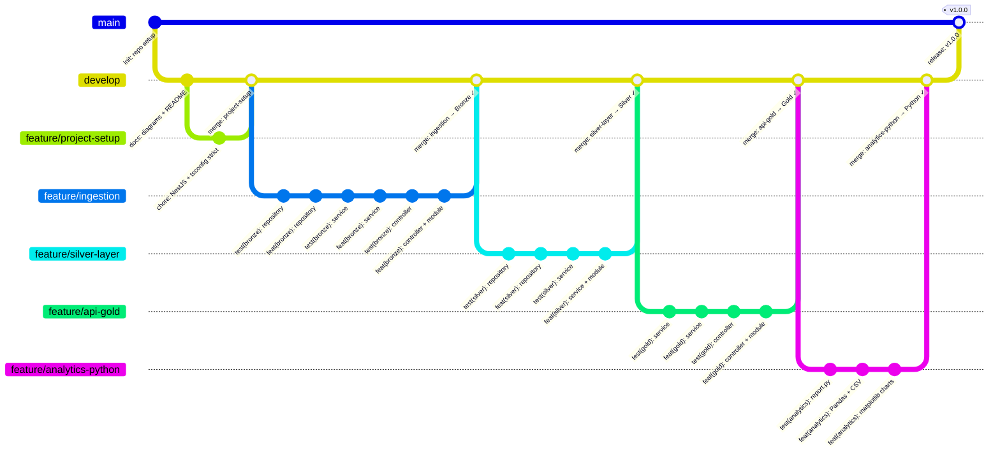

# ecommerce-pipeline

Pipeline de datos para una plataforma de E-Commerce.
Recibe eventos de ventas via API REST y los procesa en tres capas (Bronze → Silver → Gold) siguiendo la Arquitectura Medallón. Expone métricas de negocio via GET endpoint y genera reportes analíticos con Python/Pandas.

---

## Tecnologías

- **NestJS + TypeScript** — API REST con tipado estricto
- **Jest** — testing con TDD (43 tests)
- **BigQuery** — simulado localmente con Repository Pattern
- **Python 3 + Pandas + Matplotlib** — análisis y visualización de datos
- **GCP** — arquitectura de producción escalable

---

## Cómo ejecutar localmente

### Requisitos previos

- Node.js >= 18
- Python >= 3.10
- Git

### Paso 1 — Clonar e instalar dependencias

```bash
git clone https://github.com/danielyatacoblas/data-e_commerce-medallion.git
cd data-e_commerce-medallion
npm install
```

### Paso 2 — Configurar variables de entorno

```bash
cp .env.example .env
```

> Para correr localmente solo necesitas `PORT=3000`. Las variables de GCP son para cuando se conecte a la infraestructura real.

### Paso 3 — Levantar el servidor (Terminal 1)

Abre una terminal y déjala corriendo:

```bash
npm run start:dev
```

Verás este output cuando el servidor esté listo:

```
[Nest] LOG [NestFactory] Starting Nest application...
[Nest] LOG [InstanceLoader] BronzeModule dependencies initialized
[Nest] LOG [InstanceLoader] SilverModule dependencies initialized
[Nest] LOG [InstanceLoader] GoldModule dependencies initialized
[Nest] LOG [RouterExplorer] Mapped {/v1/events, POST} route
[Nest] LOG [RouterExplorer] Mapped {/v1/metrics/category-sales, GET} route
[Nest] LOG [NestApplication] Nest application successfully started
```

El servidor corre en `http://localhost:3000`. **Deja esta terminal abierta.**

### Paso 4 — Ingresar eventos al pipeline (Terminal 2)

Abre una segunda terminal. Envía eventos con `POST /v1/events` — cada llamada persiste el evento en la capa **Bronze**:

```bash
curl -X POST http://localhost:3000/v1/events \
  -H "Content-Type: application/json" \
  -d '{
    "transaction_id": "tx_001",
    "customer_id": "usr_abc123",
    "timestamp": "2026-05-21 15:30:00 UTC",
    "product": {
      "id": "prod_55",
      "category": "Electronics",
      "price": 299.99
    },
    "quantity": 2
  }'
```

Respuesta `201` por cada evento enviado:

```json
{ "status": "received", "transaction_id": "tx_001", "layer": "bronze" }
```

Puedes enviar varios eventos con distintas categorías y fechas para ver el pipeline completo.

**Para generar 120 eventos masivos de golpe**, instala las dependencias Python y ejecuta el generador automático:

```bash
cd analytics/
pip install -r requirements.txt
python generate_events.py
```

Output esperado:

```
Enviando 120 eventos al pipeline...
  20/120 — ultimo: tx_0020 -> received
  ...
  120/120 — ultimo: tx_0120 -> received

Obteniendo metricas Gold (Bronze -> Silver -> Gold)...
  Registros agregados: 85

Guardado: gold_data.json
```

### Paso 5 — Consultar métricas Gold (Terminal 2)

Una sola llamada GET dispara todo el pipeline: Bronze → Silver (limpieza) → Gold (agregación):

```bash
curl http://localhost:3000/v1/metrics/category-sales
```

Respuesta `200` con ventas agrupadas por categoría y día:

```json
[
  {
    "category": "Electronics",
    "sale_date": "2026-05-21",
    "total_sales": 599.98,
    "transaction_count": 2
  },
  {
    "category": "Clothing",
    "sale_date": "2026-05-21",
    "total_sales": 149.97,
    "transaction_count": 3
  }
]
```

### Paso 6 — Generar reporte analítico Python (Terminal 2)

Con el servidor aún corriendo, en la misma segunda terminal ejecuta el script analítico (las dependencias ya se instalaron en el paso anterior):

```bash
cd analytics/
python report.py
```

Output esperado:

```
Archivos generados:
  CSV : .../analytics/summary_report.csv
  PNG : .../analytics/charts/sales_by_category.png
  PNG : .../analytics/charts/ticket_promedio_by_category.png

     category  total_sales  transaction_count  ticket_promedio
     Clothing       239.96                  2           119.98
  Electronics      1149.96                  3           383.32
Home & Garden       134.97                  1           134.97
```

Esto genera en `analytics/`:
- `summary_report.csv` — tabla de métricas por categoría
- `charts/sales_by_category.png` — donut de distribución de ventas
- `charts/ticket_promedio_by_category.png` — lollipop de ticket promedio
- `charts/sales_trend.png` — tendencia diaria de ventas (línea + área)
- `charts/daily_transactions.png` — transacciones diarias (área apilada)

### Paso 7 — Correr los tests

```bash
# Desde la raíz del proyecto
npm run test
```

---

## Flujo del Pipeline

```
POST /v1/events
      |
      v
 [Bronze Layer]
 Guarda evento raw + agrega ingested_at
      |
      v
 [Silver Layer]  <-- se activa al llamar GET /v1/metrics
 - Convierte timestamp a ISO 8601
 - Calcula total_amount = price x quantity
 - Rechaza registros con total_amount <= 0 (error_events)
      |
      v
 [Gold Layer]
 Agrega SUM(total_sales) y COUNT(*) GROUP BY category, DATE
      |
      v
 GET /v1/metrics/category-sales
```

---

## Arquitectura Medallón (local)


| Capa | Qué hace |
|------|----------|
| **Bronze** | Guarda el evento JSON exactamente como llega, sin tocar nada |
| **Silver** | Limpia la fecha, calcula `total_amount = price × quantity`, rechaza montos ≤ 0 |
| **Gold** | Agrupa ventas por categoría y día (`SUM`, `COUNT`) para el negocio |

---

## Analytics Python

### Instalación

```bash
cd analytics/
pip install -r requirements.txt
```

### Generar datos masivos (opcional)

Si quieres alimentar el pipeline con 120 eventos reales antes de correr el reporte:

```bash
# Con el servidor corriendo en Terminal 1:
python generate_events.py
```

Output esperado:

```
Enviando 120 eventos al pipeline...
  20/120 — ultimo: tx_0020 -> received
  ...
  120/120 — ultimo: tx_0120 -> received

Obteniendo metricas Gold (Bronze -> Silver -> Gold)...
  Registros agregados: 85

Guardado: gold_data.json
```

### Ejecución del reporte

```bash
python report.py
```

El script:
1. Lee `gold_data.json` (datos exportados del endpoint Gold)
2. Calcula `ticket_promedio = total_sales / transaction_count` por categoría con Pandas
3. Guarda `summary_report.csv`
4. Genera 4 gráficas KPI en `charts/`

### Resultado CSV

Basado en 120 eventos procesados a través del pipeline completo:

| category | total_sales | transaction_count | ticket_promedio |
|----------|------------|-------------------|-----------------|
| Books | 2,979.58 | 31 | 96.12 |
| Clothing | 3,108.59 | 17 | 182.86 |
| Electronics | 17,624.99 | 25 | 705.00 |
| Home & Garden | 7,516.00 | 19 | 395.58 |
| Sports | 6,401.73 | 28 | 228.63 |

### Dashboard KPI

**Distribución de ventas por categoría (Donut)**


**Ticket promedio por categoría (Lollipop)**


**Tendencia de ventas diarias (Línea + área)**


**Transacciones diarias por categoría (Área apilada)**


---

## Escalabilidad e implementación en GCP


> Ver versión detallada: [`diagrams/diagram_gcp_Detailed.png`](diagrams/diagram_gcp_Detailed.png) — Infraestructura como código en [`terraform/main.tf`](./terraform/main.tf)

Con millones de eventos por segundo, el cuello de botella es que la ingesta y el procesamiento no pueden correr en el mismo proceso. La solución es desacoplar cada capa Medallón en un servicio GCP gestionado que escala de forma independiente:

- **Cloud Run** recibe el `POST /v1/events`, valida el JSON y publica en Pub/Sub. Escala horizontalmente de forma automática ante cualquier pico de tráfico.
- **Pub/Sub** actúa como buffer entre la ingesta y el ETL. Cloud Run responde `201` inmediatamente sin esperar a que se procese nada — ningún evento se pierde aunque Dataflow esté ocupado.
- **Dataflow** (Apache Beam) consume el topic en streaming, aplica las transformaciones Silver y escribe en BigQuery. Auto-escala sus workers según el lag acumulado.
- **BigQuery** almacena las tres capas Medallón. Las tablas están particionadas por fecha y agrupadas por categoría, lo que reduce el costo y la latencia de consulta a escala de petabytes. La capa Gold es una vista materializada que se refresca sola cada hora.

| Local | GCP | Rol |
|-------|-----|-----|
| `BronzeController` | **Cloud Run** | Ingesta HTTP escalable |
| Trigger interno | **Pub/Sub** | Buffer elástico sin pérdida de eventos |
| `SilverService` | **Dataflow** | ETL en streaming con Apache Beam |
| `InMemoryRepository` | **BigQuery** | Almacén columnar particionado por fecha |
| Vista Gold | **BigQuery** vista materializada | Métricas pre-agregadas, refresco automático |
| — | **Cloud Storage** | Backup raw y templates de Dataflow |
| — | **Cloud Monitoring** | Alertas de lag, errores y costos |

**Flujo en producción:**
```
E-Commerce → Cloud Run → Pub/Sub → Dataflow → BigQuery → Cloud Run (Metrics) → Negocio
```

---

## Estructura del proyecto

```
ecommerce-pipeline/
├── src/
│   ├── bronze/        # Capa Bronze — ingesta raw
│   ├── silver/        # Capa Silver — limpieza y validación
│   ├── gold/          # Capa Gold — métricas de negocio
│   ├── common/        # Interfaces compartidas entre capas
│   └── main.ts
├── analytics/
│   ├── report.py          # Script Pandas + Matplotlib
│   ├── gold_data.json     # Datos de ejemplo exportados desde Gold
│   ├── summary_report.csv # Resultado generado
│   ├── requirements.txt   # Dependencias Python
│   └── charts/            # Gráficas KPI generadas
├── diagrams/          # Diagramas de arquitectura
├── terraform/
│   └── main.tf        # Infraestructura GCP como código
├── .env.example
└── README.md
```

---

## GitFlow



| Rama | Propósito |
|------|-----------|
| `main` | Código estable — tag `v1.0.0` |
| `develop` | Integración continua entre fases |
| `feature/project-setup` | NestJS + TypeScript strict |
| `feature/ingestion` | Bronze + `POST /v1/events` |
| `feature/silver-layer` | Silver + validación + limpieza |
| `feature/api-gold` | Gold + `GET /v1/metrics/category-sales` |
| `feature/analytics-python` | `report.py` + Pandas + Matplotlib |

---

## Declaración de uso de IA

Se utilizó **Claude (Anthropic)** como asistente de desarrollo. El contexto que le di y los patrones que documenté están en [`CLAUDE.md`](./CLAUDE.md) y [`skills/`](./skills/).

| Skill | Cómo ayudó la IA |
|-------|-----------------|
| [Arquitectura Medallón](./skills/skill_medallion_nestjs.md) | Propuso la estructura de módulos NestJS y la jerarquía de interfaces — yo ajusté las reglas de negocio por capa |
| [TypeScript strict](./skills/skill_typescript_strict.md) | Generó los DTOs con `class-validator` y el patrón `import type` para interfaces con `isolatedModules` |
| [TDD con Jest](./skills/skill_tdd_jest.md) | Estructuró los archivos `.spec.ts` con mocks — cada test se ejecutó en RED antes de escribir la implementación |
| [Python analytics](./skills/skill_python_analytics.md) | Implementó las funciones de Pandas y las 4 gráficas KPI — verificadas corriendo `report.py` con datos reales |

Las decisiones de arquitectura (pipeline pull-based, idempotencia en Silver, separación de capas) las tomé en base al enunciado. La validación fue: tests en verde antes de cada commit y pipeline completo verificado con curl — 120 eventos POST → GET metrics → CSV + gráficas sin errores.
